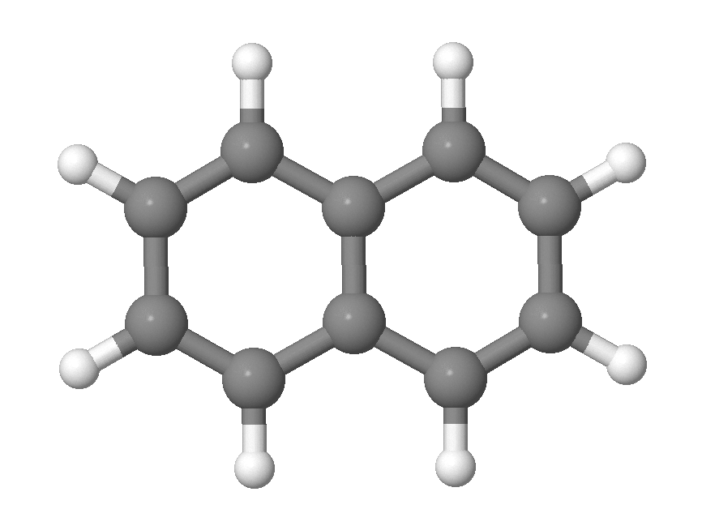

# SchNet4AIM

SchNet4AIM is a code designed to train SchNet [1] models on atomic (1p) and pair-wise (2p) 
properties, such as those formulated within the context of the Quantum Theory of Atoms In Molecules (QTAIM). [2]

* The architecture of SchNet4AIM is a slight modification of the original SchNetPack code, [2, III] the functions
and routines of the latter which are not involved in the training and prediction of 1p or 2p properties have been removed
for the sake of simplicity.
* The code can run on both CPUs and GPUs. The use of the latter is generally advisable for the sake of computational
time.
* Before importing or initializing the SchNet4AIM module, three bash environment variables must be specified:
  * Pmode : defines the type of target property. It can take two different values: "1p", for atomic properties, or "2p", for pair-wise properties.
  * DBmode: defines the format employed for the database. It can take the "json" or "db" values, corresponding to the JSON and ASE-SQLite [3] database formats, respectively.
  * frset : defines the list of possible elements found in the database employed for the training, given in terms of their atomic numbers.

The environment variables can be easily defined using a simple block of python code (which should be included in the heading of the training or prediction scripts):

    dbname          = "./database_q.db"   # name of the database used throughout the training (*.json or *.db file formats are allowed)
    elements        =  [1,8]              # possible atomic numbers of the elements found in the database (e.g H,O)
    
    # Setting the bash environment variables controlling the type of property and database used.
    import os
    os.environ['Pmode']   = mode          # 1p (atomic properties) or 2p (pairwise properties).
    os.environ['DBmode']  = dbmode
    os.environ['frset']   = os.pathsep.join(str(i) for i in sorted(elements))

# System Requirements

## Hardware requirements

SchNet4AIM package requires only a standard computer with enough RAM to support the in-memory operations. GPUs can be used if desired. 

## Software requirements

SchNet4AIM requires Python version 3.7.3 or higher and is compatible with versions up to 3.11.5. Ensure that you have a compatible Python installation before proceeding. It is strongly recommended to use one of the latest pip managers to install and manage dependencies. Specifically, versions 23.3.1 or 23.3.2 are recommended, up to the date of the SchNet4AIM release. Using the latest pip managers helps prevent compatibility issues and ensures a smooth installation process. The code has undergone thorough testing across various Python versions, including 3.7.3, 3.7.12, 3.8.2, 3.10.12, and 3.11.5.

### OS Requirements

The package is designed to be compatible with any operating system capable of running the mentioned Python versions. However, the use of Linux is generally encouraged. SchNet4AIM has undergone extensive testing on various distributions, including Ubuntu 22.04.3, Debian GNU/Linux 8.11, CentOS Linux release 7.9.2009, Debian GNU/Linux 10, and Ubuntu 20.04.6.

### Python Dependencies

SchNet4AIM relies on the following Python packages and modules:

    ase==3.22.1
    cycler==0.11.0
    fonttools==4.38.0
    joblib==1.3.2
    kiwisolver==1.4.4
    matplotlib>=3.5.3,<=3.8.2
    numpy>=1.21.6,<1.24
    nvidia-cublas-cu11==11.10.3.66
    nvidia-cuda-nvrtc-cu11==11.7.99
    nvidia-cuda-runtime-cu11==11.7.99
    nvidia-cudnn-cu11==8.5.0.96
    packaging==23.1
    Pillow==9.5.0
    psutil==5.9.7
    pyparsing==3.1.0
    python-dateutil==2.8.2
    scikit-learn>=1.0.2,<=1.3.2
    scipy>=1.7.3,<=1.10.1
    six==1.16.0
    threadpoolctl>=3.1.0,<=3.2.0
    torch==1.13.1
    tqdm==4.65.0
    typing_extensions==4.7.1
   
# Installation guide

**SchNet4AIM can be installed under Python >= 3.7.3 and <= 3.11.5 versions. Furthermore, it is strongly encouraged to use one of the latest pip managers (i.e 23.3.1 or 23.3.2 up to the date of release of SchNet4AIM) to avoid incompatibility problems.**

The code requires other Python modules to run which will be installed along with the former (if not present in the local machine). To avoid incompatibilities, it is generally advisable to install and run SchNet4AIM under a Python environment:

    python -m venv venv
    source /venv/bin/activate  

After activating the Python environment, make sure to update the pip manager as:
    
    pip install --upgrade pip

SchNet4AIM can then be easily installed as

    pip install git+https://github.com/m-gallegos/SchNet4AIM.git

Alternatively, one can download the zip file from the SchNet4AIM GitHub and run the following command:

    pip install SchNet4AIM-main.zip

**Some (specially old) architectures are known to struggle accessing certain libraries or may raise problems (e.g RunTimeErrors) when importing certain modules (as for instance found in the particular case of torch and sklearn packages). These problems are, however, not related to SchNet4AIM and are likely to be caused by Python incompatibility issues in old architectures.**

# Examples

In addition to the SchNet4AIM source code, this repository also includes a set of prototype scripts to exemplify its use, collected in the /examples/scripts/ directory.In particular, we include two key templates, one aimed at predicting the electronic QTAIM properties (Q, LI and DI) from a molecular geometry (including uncertainty estimates) and the other devoted to the analysis of the pairwise components that dominate the electron delocalization between two groups or fragments along a sequential process. We note in passing that both are based on the proof-of-concept models incorporated in SchNet4AIM and are therefore only suitable for treating neutral C,H,O,N molecules. All molecular geometries must be given as XYZ files (in Angstroms).

**Please note that the models included here are proof-of-concept examples used to show the applicability and potential of SchNet4AIM in predicting local quantum chemical properties. Therefore, for specific applications and scenarios, users must train their own models oriented to the desired chemical properties and spaces.**

## Predicting QTAIM electronic properties.

The script /examples/scripts/predict_QTAIM_electron_metrics.py is a simple python template designed to ease the prediction of QTAIM electron metrics (localization index, LI, delocalization index, DI, and atomic charges, Q). It receives two command-line arguments:

    python predict_QTAIM_electron_metrics.py geom.xyz nproc

  * geom.xyz : file containing the molecular geometry in XYZ Cartesian coordinates. In the  /examples/scripts/ folder you will find an example of a typical geometry file (naphthalene.xyz).
  * nproc    : number of CPUs to be employed in the calculation.

In the example, the geometry of naphthalene is included.

Executing the previous script will produce an output file, **geom_s4aim.qtaim**, which comprises the SchNet4AIM predictions along with their uncertainties.The output format used is the following: first, the atomic properties (charges and LIs) appear in increasing order of the atoms, 

    -----------------------------------------------------------------------------
    ATOMIC CHARGE (Q)
    -----------------------------------------------------------------------------
    Atom      1 (C )  q = -0.031 +- 0.000 : -0.031 to -0.031 electrons.
    Atom      2 (C )  q = -0.029 +- 0.000 : -0.029 to -0.029 electrons.
    Atom      3 (C )  q = -0.004 +- 0.000 : -0.004 to -0.004 electrons.
    Atom      4 (C )  q = -0.004 +- 0.000 : -0.004 to -0.004 electrons.
    . . . . . . . . 
    . . . . . . . . 
    -----------------------------------------------------------------------------
    ELECTRON LOCALIZATION INDEX (LI)
    -----------------------------------------------------------------------------
    Atom      1 (C )  li =  3.968 +- 0.000 :  3.968 to  3.968 electrons.
    Atom      2 (C )  li =  3.968 +- 0.000 :  3.968 to  3.968 electrons.
    Atom      3 (C )  li =  3.889 +- 0.000 :  3.889 to  3.889 electrons.
    Atom      4 (C )  li =  3.889 +- 0.000 :  3.889 to  3.889 electrons.
    . . . . . . . . 
    . . . . . . . . 

followed by the delocalization indices of each of the pairs. For the latter, the results for the single pairs (upper triangular part of the matrix) are presented:

    -----------------------------------------------------------------------------
    ELECTRON DELOCALIZATION INDEX (DI)
    -----------------------------------------------------------------------------
    Pair      1     2 (C ,C ) DI =  1.513 +- 0.000 :  1.513 to  1.513 electrons.
    Pair      1     3 (C ,C ) DI =  1.236 +- 0.000 :  1.236 to  1.237 electrons.
    Pair      1     4 (C ,C ) DI =  0.059 +- 0.000 :  0.059 to  0.059 electrons.
    Pair      1     5 (C ,C ) DI =  0.094 +- 0.000 :  0.094 to  0.094 electrons.
    Pair      1     6 (C ,C ) DI =  0.073 +- 0.000 :  0.073 to  0.074 electrons.
    Pair      1     7 (C ,C ) DI =  0.067 +- 0.000 :  0.067 to  0.067 electrons.
    Pair      1     8 (C ,C ) DI =  0.024 +- 0.000 :  0.024 to  0.024 electrons.
    Pair      1     9 (C ,C ) DI =  0.025 +- 0.000 :  0.024 to  0.025 electrons.
    Pair      1    10 (C ,C ) DI =  0.011 +- 0.000 :  0.011 to  0.011 electrons.
    Pair      1    11 (C ,H ) DI =  0.952 +- 0.000 :  0.952 to  0.952 electrons.
    . . . . . . . . 
    . . . . . . . . 
We note in passing that the uncertainties are based on the accuracy with which SchNet4AIM reconstructs the total number of electrons of the molecule (either from the atomic charges or the localized and delocalized electron populations). Since the proof-of-concept models used have been independently trained, the latter terms are not bound to be exactly additive, which leads to the reported uncertainty in the predictions.
    
## XCAI: Unraveling the dominant contributions to the group DI.

The /examples/scripts/explain_group_DI.py script is a simple Python template designed to identify the dominant pairwise interactions that dominate the behavior of a global property (in this case, the group delocalization index), thanks to the inherent explainability of SchNet4AIM models. The script receives a single command-line argument, being the name of the trajectory file in Cartesian coordinates (**trj_file.xyz**)

    python explain_group_DI.py trj_file.xyz

  * trj_file.xyz: trajectory file comprising the evolution of the system in a sequential process. It uses a standard XYZ format (concatenation of XYZ files each of which corresponding to a frame or snapshot of the system).
  
In the  /examples/scripts/ folder you will find an example of a typical trajectory file (13P-CO2_trj.xyz), with the following format:

    95    # Number of atoms
    Frame 1
    C     -0.4216901378      7.8480921389      3.3939225697
    O     -0.6794395988      8.7715685111      3.9675109420
    O     -0.1478306150      6.9300913248      2.8153027169
    . . . . . . . . 
    . . . . . . . . 
    95    # Number of atoms
    Frame 2
    C     -0.4213420307      7.8921081530      3.3822648304
    O     -0.7406936146      8.8399292588      4.0130434743
    O     -0.1405877282      6.9341261177      2.8085651859
    . . . . . . . . 
    . . . . . . . .
    continues for as many frames as snapshoots of the trajectory.

Besides this, the script also requires the following variables to be specified inside the explain_group_DI.py file:

  * group_a   : (list of integers) Define atom numbers of group A (starting at 1).
  * group_b   : (list of integers) Define atom numbers of group B (starting at 1).
  * threshold : (float) Cumulative explainability threshold (0 to 1).
  * nproc     : (int) Number of CPUs to be employed.

Following, we show an example of the values taken by the previous input variables (to be used in combination with the 13P-CO2_trj.xyz file.)

    # INPUT VARIABLES:
    #------------------------------------------------------------------------------------------------------------------------
    group_a  =  [1,2,3]      # CO2 group formed by atoms 1, 2 and 3.
    group_b  =  [20,23,27]   # NH2 group of 13P formed by atoms 20, 23 and 27.
    threshold=  0.8          # The dominant contributions will be those which explain at least 80% of the overall group DIs.
    nproc    =  8            # Use 8 CPUs.
    #------------------------------------------------------------------------------------------------------------------------

Executing the code will print the results of the XCAI analysis of the group DI within the frames collected in the trajectory file, shown in the standard output (screen),

   ----------------------------------------------------------------------------------
                          XCAI-GROUP ELECTRON DELOCALIZATION 
    ---------------------------------------------------------------------------------
    # GROUP A:  [1, 2, 3]
    # GROUP B:  [20, 23, 27]
    # Pair-wise contributions to A-B DI :
    - P1-20  Atom 1    (C ) Atom 20   (N ).
    - P1-23  Atom 1    (C ) Atom 23   (H ).
    - P1-27  Atom 1    (C ) Atom 27   (H ).
    - P2-20  Atom 2    (O ) Atom 20   (N ).
    - P2-23  Atom 2    (O ) Atom 23   (H ).
    - P2-27  Atom 2    (O ) Atom 27   (H ).
    - P3-20  Atom 3    (O ) Atom 20   (N ).
    - P3-23  Atom 3    (O ) Atom 23   (H ).
    - P3-27  Atom 3    (O ) Atom 27   (H ).
    ----------------------------------------------------------------------------------
    # Weights of each pairwise DI to the group DI:
    - P3-23  (var num     8):   0.6280
    - P3-20  (var num     7):   0.4429
    - P2-20  (var num     4):  -0.0883
    - P1-23  (var num     2):   0.0195
    - P2-27  (var num     6):  -0.0088
    - P1-27  (var num     3):  -0.0071
    - P1-20  (var num     1):   0.0060
    - P3-27  (var num     9):   0.0052
    - P2-23  (var num     5):   0.0026
    # Importance score of each pairwise DI to the group DI:
    - P3-23  (var num     8):   0.5197
    - P3-20  (var num     7):   0.3665
    - P2-20  (var num     4):   0.0731
    - P1-23  (var num     2):   0.0162
    - P2-27  (var num     6):   0.0072
    - P1-27  (var num     3):   0.0059
    - P1-20  (var num     1):   0.0050
    - P3-27  (var num     9):   0.0043
    - P2-23  (var num     5):   0.0022
    # Variables  [8, 7]  explain (at least)  0.8  of the group DI.
    ----------------------------------------------------------------------------------
    # Group DIs saved to            13P-CO2_trj_group_di.txt
    # Dominant components saved to  13P-CO2_trj_dominant_di_0.8.txt
   ----------------------------------------------------------------------------------

In this particular case, variables 7 and 8 (corresponding to the O3-N20 and O3-H23 interactions) dominate (up to an 80%) the net group delocalization between the CO2 and NH2 moieties. Besides this, the script produces two files: **trj_file_group_di.txt** (gathering the evolution of the group DI along with its pairwise components throughout the simulation) and the **trj_file_dominant_di_threshold.txt** (gathering the evolution of the group DI along with the reconstructed value from its dominant pairwise contributions). The latter can be easily plotted,

showing that in such a particular time-window the CO2 molecule gets closer to one of the NH2 moieties of the 13P skeleton, resulting in the emergence of O-H and O-N interactions, in agreement with the SchNet4AIM XCAI trends.

# References

[1] (I) K. Schütt, P.-J. Kindermans, H. E. Sauceda Felix, S. Chmiela, A. Tkatchenko and K.-R. Müller, Advances in Neural Information Processing Systems, 2017. (II) K. T. Schütt, H. E. Sauceda, P.-J. Kindermans, A. Tkatchenko and K.-R. Müller, J. Chem. Phys., 2018, 148, 241722. (III)  K. T. Schütt, P. Kessel, M. Gastegger, K. A. Nicoli, A. Tkatchenko and K.-R. Müller, J. Chem. Theory Comput., 2019, 15, 448–455.

[2] R. Bader, Atoms in Molecules: A Quantum Theory, Oxford University Press, Oxford, 1990.

[3] https://wiki.fysik.dtu.dk/ase/ase/db/db.html#ase-db
